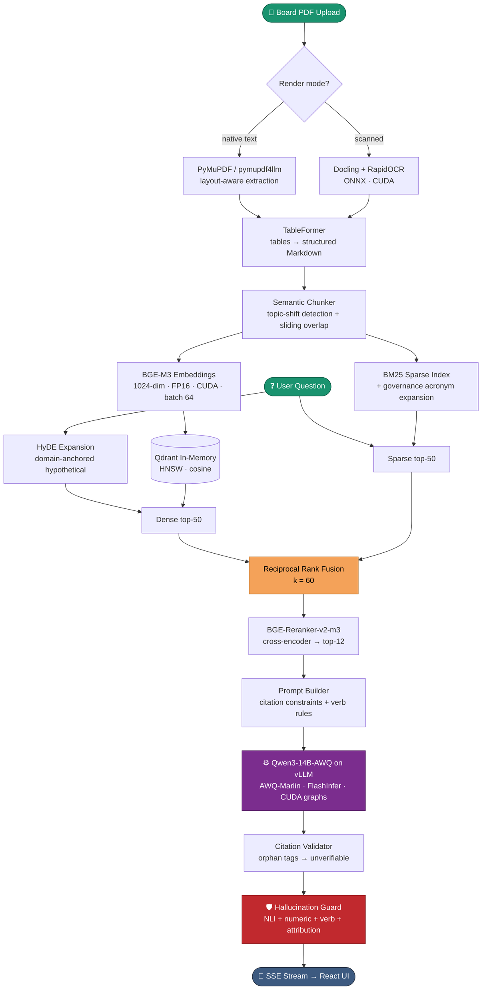
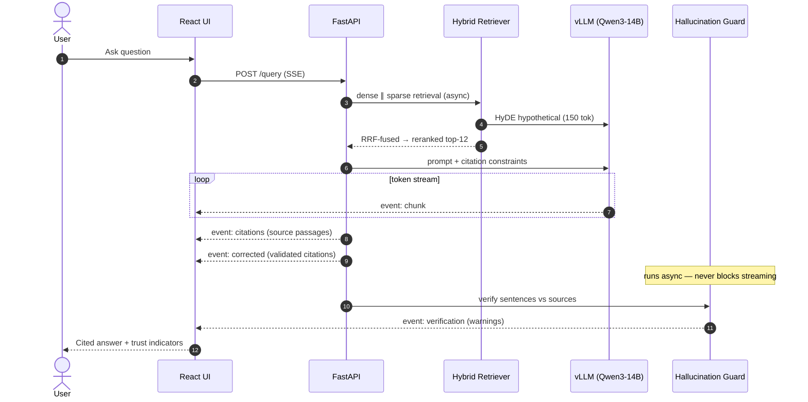
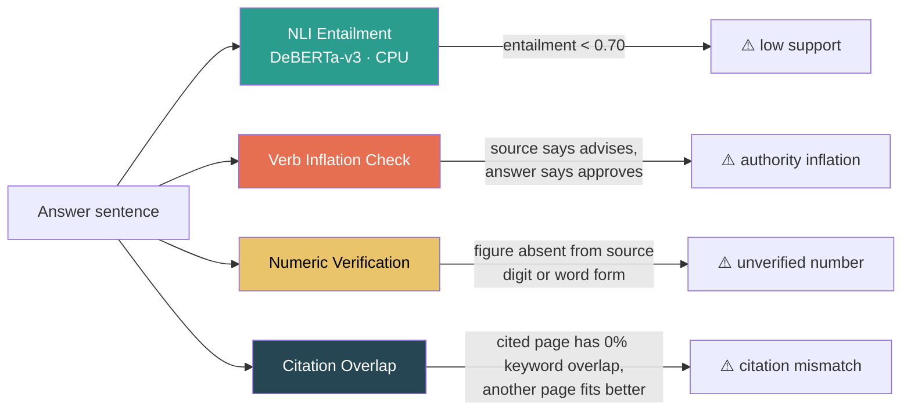
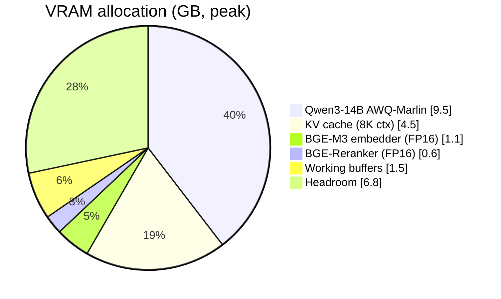
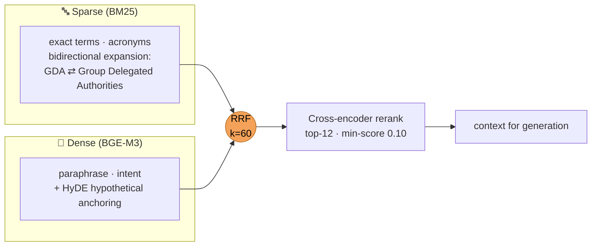
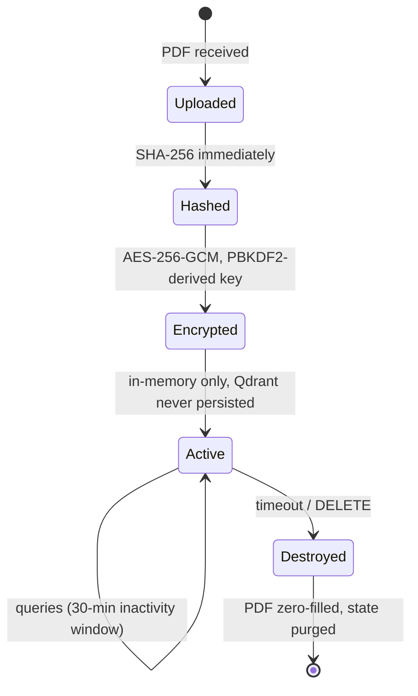

<div align="center">


<br/>


<br/>

**140–160 tok/s** on an RTX 5090 · **~2.4 s** to first token · **100%** page recall · **98.8%** citation coverage

</div>

---

## Why This Exists

Board meetings generate dense, high-stakes documents: financial summaries, risk disclosures, strategic resolutions, governance decisions. Extracting a specific fact quickly is hard — and these documents are far too sensitive for any cloud API.

**Board Intelligence** ingests the PDF into a hybrid retrieval pipeline on local hardware and answers questions with **page-level citations that are verified against the source text** — including a governance-aware hallucination guard that catches when an LLM quietly promotes *"the committee reviewed"* into *"the committee approved"*.

<div align="center">

| 🔒 Private by construction | ⚡ GPU-accelerated | 🎯 Verified answers | 🧠 Governance-aware |
|:---:|:---:|:---:|:---:|
| AES-256 ephemeral sessions, localhost-only, zero egress | Qwen3-14B + BGE-M3 + reranker co-resident in 24 GB VRAM | Every bullet cited `[Page N]` and NLI-checked against source | Detects authority inflation, misattributed approvals, orphan citations |

</div>

---

## Architecture

<div align="center">


</div>



### Query Lifecycle



---

## The Verification Layer 🛡️

Most RAG systems stop at retrieval. This one **audits its own answers** in four independent passes:



The verb-inflation check is domain-novel: governance documents legally distinguish **advisory** verbs (*reviews, discusses, advises*) from **executive** verbs (*approves, manages, authorizes*). LLMs routinely inflate the former into the latter. The guard resolves committee-vs-board pronoun coreference (*"advises the Board… **It** approves"* → the **Board** approves), checks approval events against shareholder/AGM attribution, and skips oversight committees (Audit, Risk) for which executive verbs are accurate.

---

## Performance

Measured on the reference machine (RTX 5090 Laptop, 24 GB VRAM) against a 15-item domain golden set — evaluated **fully locally**, no external judge API.

| Metric | Target | Result | |
|---|---|---|---|
| Query → first token | < 4 s | **~2.4 s** | `██████████████████░░` |
| 3-page PDF ingest | < 120 s | **~4 s** | `████████████████████` |
| Keyword recall | > 80% | **100%** | `████████████████████` |
| Page recall | > 70% | **100%** | `████████████████████` |
| Citation coverage | > 90% | **98.8%** | `███████████████████░` |
| Abstention on adversarial | 100% | **100%** | `████████████████████` |
| Avg guard warnings (clean queries) | < 2.0 | **0.75** | `████████████████████` |
| LLM throughput | — | **140–160 tok/s** | FlashInfer + CUDA graphs |

### VRAM Budget — Four Models, One 24 GB GPU



*The NLI guard (DeBERTa-v3-small) runs on CPU by design — it verifies asynchronously and never competes with generation for VRAM.*

---

## Retrieval: Why Hybrid + RRF

Dense and sparse retrieval fail differently: BM25 nails exact terminology and acronyms (`GDA`, `HSSC`, `MCS`); dense embeddings catch paraphrase and intent. Reciprocal Rank Fusion merges both **without score normalization**:

$$rrf(c) = \sum_{lists} \frac{1}{k + rank(c)}, \quad k = 60$$



The chunker is semantic, not fixed-width: sentences are embedded, adjacent cosine similarity below 0.70 marks a topic boundary, and 50-token sliding overlap preserves context across cuts. Tables are atomic — never split mid-row.

---

## Tech Stack

| Layer | Technology | Detail |
|---|---|---|
| 🧠 LLM | **Qwen3-14B-AWQ** on vLLM 0.23 | AWQ-Marlin, FP16, FlashInfer attention, CUDA graphs |
| 🧭 Embeddings | **BGE-M3** (FlagEmbedding) | 1024-dim dense, 8K context, FP16 CUDA |
| 🎯 Reranker | **BGE-Reranker-v2-m3** | Cross-encoder precision scoring |
| 🛡️ Guard | **DeBERTa-v3-small NLI** | CPU, async, sentence-level entailment |
| 📄 Parsing | **Docling + PyMuPDF** | DocLayNet layout, TableFormer tables, RapidOCR fallback |
| 🔍 Vector store | **Qdrant** (in-memory) | HNSW, cosine, session-ephemeral |
| 🔤 Sparse index | **rank-bm25** | k1=1.2, b=0.5, acronym expansion |
| ⚙️ Backend | **FastAPI + Uvicorn** | SSE streaming, localhost-only |
| 🖥️ Frontend | **React 18 + Vite + Tailwind** | Streaming chat, source panel, error boundaries |
| 🚀 Orchestration | **PowerShell + WSL scripts** | One command launches vLLM (WSL) + backend + frontend |

---

## Security Model



- FastAPI binds to `127.0.0.1` **only** — never exposed to the network
- No model call, embedding, or evaluation ever touches an external URL or API key
- Temp files land in a per-session directory with `0600` permissions
- Deleted PDFs are **zero-filled before removal** — not just unlinked
- No query or document content is logged in production mode

---

## Quick Start

```powershell
scripts\start_all.ps1        # launches vLLM (WSL) → backend → frontend, health-checked
# then open http://localhost:5173
```

<details>
<summary><b>📦 Full setup from scratch (click to expand)</b></summary>

The stack runs natively: FastAPI backend and React frontend directly on Windows, vLLM inside WSL Ubuntu (vLLM requires Linux).

### 1. Prerequisites

- WSL2 ≥ 2.7.0 with an Ubuntu distro (`wsl --update` if needed)
- NVIDIA driver ≥ 592.01, CUDA-capable GPU with 16+ GB VRAM
- Python 3.12+ on Windows, Node 20+
- ~50 GB free disk for models

**Critical: cap WSL memory in `C:\Users\<you>\.wslconfig`:**

```ini
[wsl2]
memory=12GB
swap=16GB
localhostForwarding=true
```

WDDM backs GPU allocations with *Windows-side* RAM. An uncapped WSL VM starves Windows during model loading and dxgkrnl refuses GPU memory commits — vLLM then dies with random CUDA OOMs while `nvidia-smi` shows free VRAM. Run `wsl --shutdown` after editing.

### 2. Download models (one-time, ~11 GB)

```bash
pip install huggingface_hub docling
python scripts/download_models.py
```

### 3. Install backend dependencies

```powershell
python -m venv venv
venv\Scripts\pip install -r requirements.txt --extra-index-url https://download.pytorch.org/whl/cu128
python scripts/verify_gpu.py     # CUDA available, sm_120, torch cu128, VRAM >= 20 GB
```

### 4. Configure

```powershell
cp .env.example .env
# set SESSION_SECRET_KEY, absolute model paths, TEMP_SESSION_DIR
```

### 5. Run

```powershell
scripts\start_all.ps1
```

First run auto-installs vLLM into `~/.venvs/vllm` inside WSL (pinned to 0.23.0 — newer releases regress on WSL2 Blackwell), installs a **user-local CUDA 12.8 toolkit** to `~/cuda-12.8` (official NVIDIA debs via `dpkg -x`, no root needed), and applies the flashinfer sm_120 patch.

> **Tip:** copy the model into WSL once (`cp -r /mnt/e/.../models/Qwen3-14B-AWQ ~/models/`) and set `VLLM_MODEL_DIR` for much faster startup than loading over 9P.

</details>

<details>
<summary><b>🔌 API reference (click to expand)</b></summary>

### Ingest a PDF

```bash
curl -X POST http://localhost:8000/ingest -F "file=@board_minutes.pdf"
```

```json
{ "session_id": "3f7a2c1e-…", "page_count": 42, "chunk_count": 187, "ingest_time_seconds": 38.4 }
```

### Ask a question (SSE stream)

```bash
curl -X POST http://localhost:8000/query \
  -H "Content-Type: application/json" -H "X-Session-ID: 3f7a2c1e-…" \
  -d '{"question": "What capital expenditure was approved?", "use_hyde": true}'
```

```
event: chunk          data: {"text": "…"}                       ← token stream
event: citations      data: {"chunks": [{…}]}                   ← source passages
event: corrected      data: {"text": "…"}                       ← citation-validated answer
event: verification   data: {"warnings": [{…}]}                 ← guard findings
event: done           data: {"total_tokens": 84, "latency_ms": 3210}
```

### Health & session

```bash
curl http://localhost:8000/health
curl -X DELETE http://localhost:8000/session/3f7a2c1e-…      # zero-fills PDF, purges state
```

</details>

<details>
<summary><b>🗂️ Project structure (click to expand)</b></summary>

```
board-intelligence/
├── scripts/
│   ├── start_all.ps1            # one-command launcher (vLLM + backend + frontend)
│   ├── start_vllm_wsl.sh        # vLLM venv bootstrap + server (runs in WSL)
│   ├── setup_cuda128_wsl.sh     # user-local CUDA 12.8 toolkit, no root
│   ├── run_backend.py           # backend entrypoint (pyarrow preload)
│   ├── patch_flashinfer.py      # Blackwell sm_120 JIT patch
│   ├── download_models.py       # pulls all 4 models
│   └── verify_gpu.py            # environment gate
├── src/
│   ├── ingestion/               # parser, OCR, table extractor, semantic chunker
│   ├── indexing/                # BGE-M3 embedder, BM25, Qdrant store
│   ├── retrieval/               # hybrid retriever + HyDE, RRF, reranker
│   ├── generation/              # prompt builder, vLLM client, guard, citations
│   ├── api/                     # FastAPI app, SSE routes, encrypted sessions
│   └── utils/                   # config, logging, crypto, acronym expander
├── tests/
│   ├── unit/  integration/  rag_eval/   # 23 tests + 15-item golden set
└── frontend/                    # React 18 + Vite + Tailwind
```

</details>

<details>
<summary><b>⚙️ Configuration reference (click to expand)</b></summary>

All settings via environment variables or `.env` (Pydantic Settings). Tuned defaults live in `src/utils/config.py`.

| Variable | Default | Description |
|---|---|---|
| `SESSION_SECRET_KEY` | *(required)* | AES key derivation secret |
| `VLLM_BASE_URL` | `http://127.0.0.1:11436` | vLLM endpoint (WSL) |
| `DENSE_TOP_K` / `SPARSE_TOP_K` | `50` / `50` | candidates before fusion |
| `RRF_K` | `60` | fusion constant |
| `RERANKER_TOP_K` | `12` | passages after reranking |
| `RERANKER_MIN_SCORE` | `0.10` | drop threshold (min 3 kept) |
| `BM25_K1` / `BM25_B` | `1.2` / `0.5` | BM25 tuning |
| `USE_HYDE` | `true` | HyDE expansion (queries ≥ 6 words) |
| `NLI_ENTAILMENT_THRESHOLD` | `0.70` | sentence verification bar |
| `CHUNK_TARGET_TOKENS` | `500` | semantic chunk size |
| `SESSION_TIMEOUT_MINUTES` | `30` | inactivity expiry |

</details>

<details>
<summary><b>🧠 Architecture decisions (click to expand)</b></summary>

**Why vLLM over llama.cpp?** CUDA graphs + PagedAttention + FlashInfer: 140–160 tok/s vs ~40–60 tok/s for the same model on the same GPU.

**Why BGE-M3?** Dense + sparse + ColBERT from one forward pass, 8K context, fully local.

**Why RRF over learned fusion?** No training data, no drifting hyperparameters, provably robust; `k=60` is the literature standard.

**Why AES-256-GCM for sessions?** A memory dump during an active session must not expose conversation history or document metadata in plaintext.

**Why is the NLI guard on CPU?** Verification is async and latency-tolerant; VRAM belongs to generation and retrieval.

</details>

---

## Testing & Evaluation

```bash
pytest tests/unit/ -v                                      # 20 unit tests, no GPU needed
BIS_API_URL=http://127.0.0.1:8000 pytest tests/integration/ -v
python tests/rag_eval/eval_runner.py path/to/board.pdf     # golden-set eval, fully local
```

The evaluator reports keyword recall, citation coverage, page recall, abstention accuracy, latency, and guard warning rate — **no external judge, no OpenAI calls**.

---

## Offline Operation

After one-time setup, the system needs no internet: all models are local files, all inference is local, and the API binds to `127.0.0.1` only. To move machines, transfer the repo, `./models/`, the Windows venv, and the WSL venv (`~/.venvs/vllm` + `~/cuda-12.8`).

---

<div align="center">

## License

**Internal use only. Not for distribution.**


</div>
