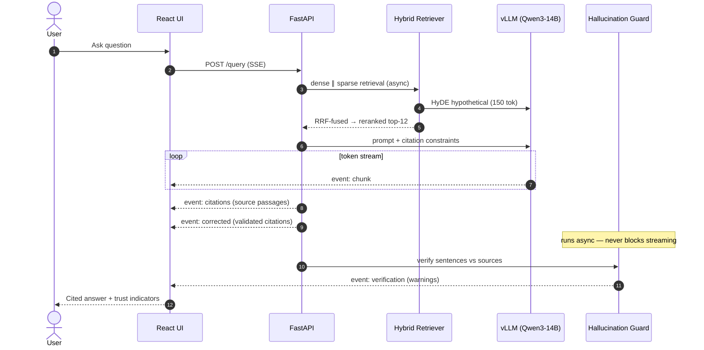
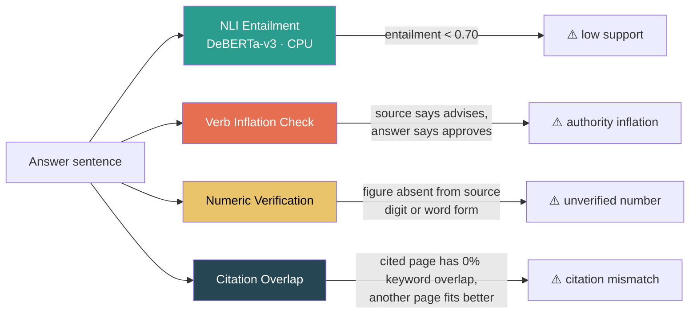
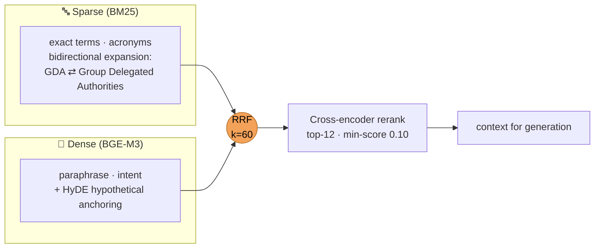
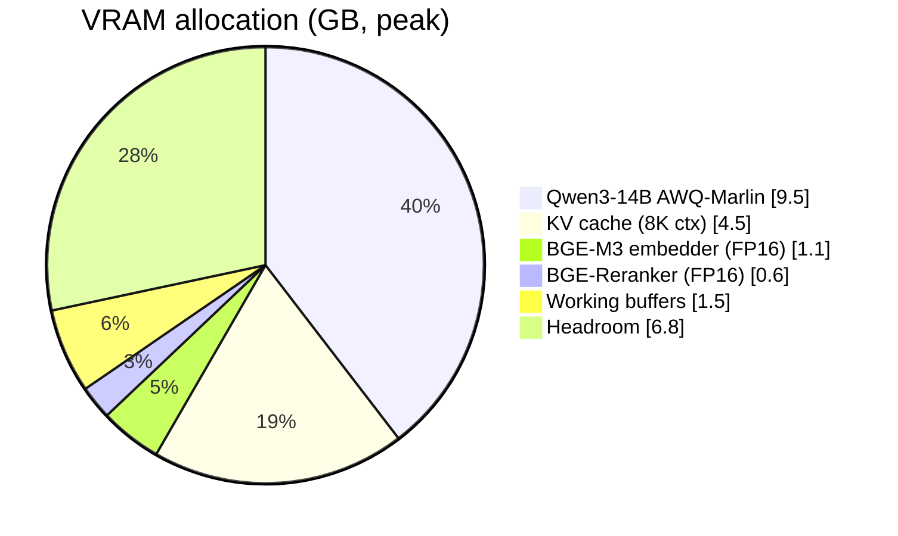
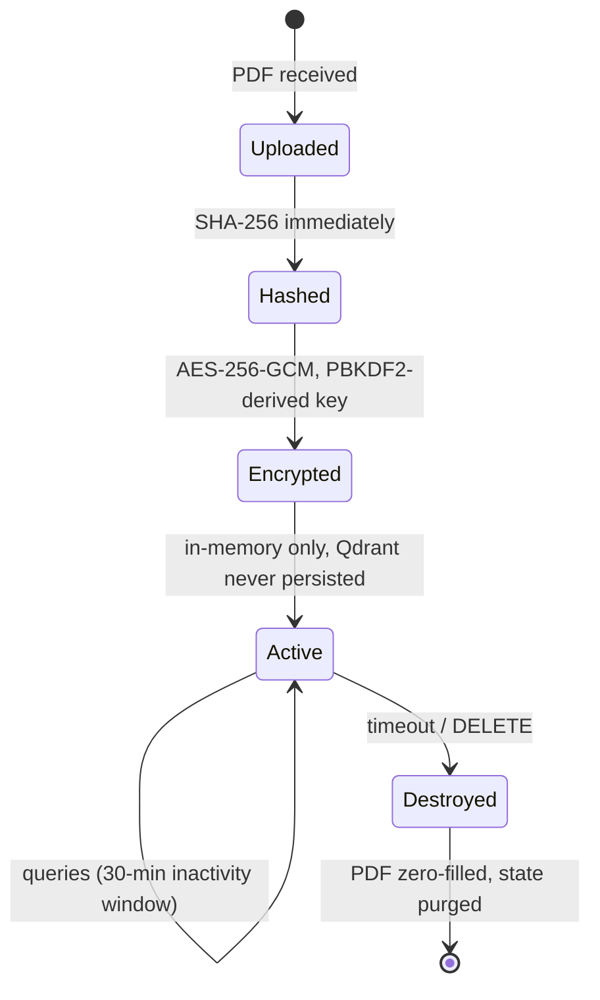

<!-- Board Intelligence — README -->
<p align="center">
  
</p>

<h1 align="center">Board Intelligence</h1>

<p align="center">
  <strong>Fully Offline, Verified RAG for Confidential Board Documents</strong><br>
  Hybrid Retrieval · Hallucination Guarding · GPU Inference · Cited Answers · Zero Network Egress
</p>

<p align="center">
  
  
  
  
  
  
</p>
<p align="center">
  
  
  
  
  
  
</p>

<p align="center">
  🔒 <strong>Private by Construction</strong> &nbsp;·&nbsp;
  ⚡ <strong>GPU Accelerated</strong> &nbsp;·&nbsp;
  🎯 <strong>Verified Citations</strong> &nbsp;·&nbsp;
  🧠 <strong>Governance Aware</strong> &nbsp;·&nbsp;
  📡 <strong>Streaming UI</strong>
</p>

> [!IMPORTANT]
> **Hardware & environment.** The full stack targets an **NVIDIA Blackwell GPU
> (`sm_120`, e.g. RTX 5090) with 24 GB VRAM**, **CUDA 12.8** (not 13.x — MMQ
> kernels segfault on Blackwell), and **Windows 11 + WSL2 ≥ 2.7.0**. The backend
> and frontend run natively on Windows; **vLLM runs inside WSL Ubuntu** (it
> requires Linux). Everything — models, inference, evaluation — runs on local
> hardware with **zero external API calls**.

---

## Table of contents

> **Reviewers & recruiters:** jump to
> [Engineering competencies demonstrated](#engineering-competencies-demonstrated)
> for a module-by-module map of the skills this project exercises.

- [Overview](#overview) · [Why](#why-board-intelligence) · [Architecture](#architecture) · [How a query flows](#how-a-query-flows) · [Features](#features)
- [The verification layer](#the-verification-layer-️) · [Retrieval design](#retrieval-why-hybrid--rrf) · [Performance](#performance) · [Security model](#security-model)
- [Technology stack](#technology-stack) · [Install](#installation) · [Quickstart](#quickstart) · [API](#api) · [Testing & evaluation](#testing--evaluation)
- [Documentation](#documentation) · [Roadmap](#roadmap)
- [Engineering competencies demonstrated](#engineering-competencies-demonstrated)

---

## Overview

**Board Intelligence** is a from-scratch, fully-local **RAG (Retrieval-Augmented
Generation) system** for confidential board documents. It ingests a board-meeting
PDF into a **hybrid dense + sparse retrieval pipeline** (BGE-M3 embeddings +
BM25, fused with Reciprocal Rank Fusion, reranked by a cross-encoder), generates
answers with **Qwen3-14B-AWQ on vLLM**, and then **audits its own output**: every
factual sentence is cited `[Page N]`, NLI-verified against the source text, and
screened by a governance-aware guard that catches when an LLM quietly promotes
*"the committee reviewed"* into *"the committee approved"*.

It is engineered to feel like production infrastructure — typed configuration,
encrypted ephemeral sessions, a reproducible golden-set evaluator, health-checked
one-command orchestration — **not** a LangChain tutorial glued together.

| Headline result | Number | Workload |
|-----------------|:------:|----------|
| **Query → first token** | **~2.4 s** | full hybrid retrieval + HyDE + rerank + vLLM streaming |
| **Citation coverage** | **98.8%** | 15-item domain golden set, evaluated fully locally |
| **LLM throughput** | **140–160 tok/s** | Qwen3-14B AWQ-Marlin, FlashInfer + CUDA graphs, RTX 5090 |

All numbers are reproducible — see [Performance](#performance) and
[Testing & evaluation](#testing--evaluation).

> **Status: all three phases complete.** The core pipeline (Phase 1), retrieval
> quality work — HyDE expansion, BM25 tuning, golden-set eval (Phase 2) — and
> production hardening — numeric verification, verb-inflation guard, error
> boundary UI (Phase 3) — are built, tested, and measured. See the
> [roadmap](#roadmap).

## Why Board Intelligence

Board meetings generate dense, high-stakes documents: financial summaries, risk
disclosures, strategic resolutions, governance decisions. Extracting a specific
fact quickly is hard — and these documents are far too sensitive for any cloud API.

| Concern | Approach |
|---------|----------|
| **Confidentiality** | Zero network egress: local models, localhost-only API, AES-256-GCM ephemeral sessions, zero-fill on delete. |
| **Hallucination** | Four independent verification passes per answer: NLI entailment, numeric check, verb-inflation check, citation overlap. |
| **Retrieval recall** | Hybrid dense + sparse with RRF fusion — BM25 nails acronyms and exact terms, BGE-M3 catches paraphrase and intent. |
| **Precision** | BGE-Reranker-v2-m3 cross-encoder re-scores fused candidates; only the top-12 above a score floor reach the prompt. |
| **Latency** | Co-resident models in 24 GB VRAM, FlashInfer attention + CUDA graphs, async dense ∥ sparse retrieval, SSE token streaming. |
| **Trust** | Every factual sentence carries a validated `[Page N]` citation; guard warnings surface in the UI, never silently dropped. |

## Architecture

<p align="center">
  
</p>


See [ARCHITECTURE.md](ARCHITECTURE.md) for the full engineering design document.

## How a query flows

A question fans out to dense and sparse retrieval **in parallel**, the fused and
reranked context feeds a streaming vLLM generation, and verification runs
**asynchronously after the stream** — trust indicators arrive without ever
blocking the first token.



## Features

- 🔒 **Private by construction** — localhost-only FastAPI, AES-256-GCM encrypted
  ephemeral sessions, SHA-256 hashing on upload, zero-filled deletes, no query
  or document content logged.
- 📄 **Layout-aware ingestion** — Docling + PyMuPDF with render-mode detection,
  RapidOCR (ONNX · CUDA) for scanned pages, TableFormer tables preserved as
  atomic structured Markdown.
- ✂️ **Semantic chunking** — embedding-based topic-shift detection (cosine < 0.70
  marks a boundary) with 50-token sliding overlap; tables never split mid-row.
- 🔎 **Hybrid retrieval** — BGE-M3 dense (1024-dim, FP16, CUDA) + BM25 sparse
  with bidirectional governance-acronym expansion, fused by RRF (k=60), reranked
  by a cross-encoder.
- 🧪 **HyDE query expansion** — a domain-anchored hypothetical answer improves
  dense recall on abstract questions.
- ⚙️ **GPU inference** — Qwen3-14B-AWQ on vLLM 0.23 with AWQ-Marlin, FlashInfer
  attention, and CUDA graphs: 140–160 tok/s on the RTX 5090.
- 🛡️ **Self-auditing answers** — four independent verification passes per
  sentence (NLI entailment, numeric, verb inflation, citation overlap), streamed
  to the UI as trust indicators.
- 📡 **Streaming UX** — SSE token stream into a React 18 chat with a source
  panel, citation highlighting, and error boundaries.
- 🧰 **One-command orchestration** — `scripts/start_all.ps1` launches vLLM (WSL),
  backend, and frontend with health checks; first run bootstraps the WSL venv
  and a user-local CUDA 12.8 toolkit (no root).

## The verification layer 🛡️

Most RAG systems stop at retrieval. This one **audits its own answers** in four
independent passes:



The verb-inflation check is domain-novel: governance documents legally
distinguish **advisory** verbs (*reviews, discusses, advises*) from **executive**
verbs (*approves, manages, authorizes*). LLMs routinely inflate the former into
the latter. The guard resolves committee-vs-board pronoun coreference
(*"advises the Board… **It** approves"* → the **Board** approves), checks
approval events against shareholder/AGM attribution, and skips oversight
committees (Audit, Risk) for which executive verbs are accurate.

## Retrieval: why hybrid + RRF

Dense and sparse retrieval fail differently: BM25 nails exact terminology and
acronyms (`GDA`, `HSSC`, `MCS`); dense embeddings catch paraphrase and intent.
Reciprocal Rank Fusion merges both **without score normalization**:

$$rrf(c) = \sum_{lists} \frac{1}{k + rank(c)}, \quad k = 60$$



## Performance

All numbers are **measured on the dev machine** (RTX 5090 Laptop, 24 GB VRAM,
Blackwell `sm_120`) against a 15-item domain golden set — evaluated **fully
locally**, no external judge API. Reproduce with
`python tests/rag_eval/eval_runner.py`.

| Metric | Target | Result | |
|---|---|---|---|
| Query → first token | < 4 s | **~2.4 s** | `██████████████████░░` |
| 3-page PDF ingest | < 120 s | **~4 s** | `████████████████████` |
| Keyword recall | > 80% | **100%** | `████████████████████` |
| Page recall | > 70% | **100%** | `████████████████████` |
| Citation coverage | > 90% | **98.8%** | `███████████████████░` |
| Abstention on adversarial | 100% | **100%** | `████████████████████` |
| Avg guard warnings (clean queries) | < 2.0 | **0.75** | `████████████████████` |
| LLM throughput | — | **140–160 tok/s** | FlashInfer + CUDA graphs |

### VRAM budget — four models, one 24 GB GPU



*The NLI guard (DeBERTa-v3-small) runs on CPU by design — it verifies
asynchronously and never competes with generation for VRAM.*

## Security model



- FastAPI binds to `127.0.0.1` **only** — never exposed to the network
- No model call, embedding, or evaluation ever touches an external URL or API key
- Temp files land in a per-session directory with `0600` permissions
- Deleted PDFs are **zero-filled before removal** — not just unlinked
- No query or document content is logged in production mode

## Technology stack

| Layer | Tech |
|-------|------|
| 🧠 LLM | **Qwen3-14B-AWQ** on vLLM 0.23 · AWQ-Marlin · FP16 · FlashInfer attention · CUDA graphs |
| 🧭 Embeddings | **BGE-M3** (FlagEmbedding) · 1024-dim dense · 8K context · FP16 CUDA |
| 🎯 Reranker | **BGE-Reranker-v2-m3** cross-encoder precision scoring |
| 🛡️ Guard | **DeBERTa-v3-small NLI** · CPU · async · sentence-level entailment |
| 📄 Parsing | **Docling + PyMuPDF** · DocLayNet layout · TableFormer tables · RapidOCR fallback |
| 🔍 Vector store | **Qdrant** (in-memory) · HNSW · cosine · session-ephemeral |
| 🔤 Sparse index | **rank-bm25** · k1=1.2 · b=0.5 · acronym expansion |
| ⚙️ Backend | **FastAPI + Uvicorn** · SSE streaming · localhost-only |
| 🖥️ Frontend | **React 18 + Vite + Tailwind** · streaming chat · source panel · error boundaries |
| 🚀 Orchestration | **PowerShell + WSL scripts** · one command launches vLLM (WSL) + backend + frontend |

## Installation

**Prerequisites:** Windows 11 + WSL2 ≥ 2.7.0 with Ubuntu, NVIDIA driver ≥ 592.01
and a CUDA-capable GPU with 16+ GB VRAM, Python 3.12+ on Windows, Node 20+,
~50 GB free disk for models.

> **Critical: cap WSL memory in `C:\Users\<you>\.wslconfig`:**
>
> ```ini
> [wsl2]
> memory=12GB
> swap=16GB
> localhostForwarding=true
> ```
>
> WDDM backs GPU allocations with *Windows-side* RAM. An uncapped WSL VM starves
> Windows during model loading and dxgkrnl refuses GPU memory commits — vLLM then
> dies with random CUDA OOMs while `nvidia-smi` shows free VRAM. Run
> `wsl --shutdown` after editing.

```powershell
# 1. Download models (one-time, ~11 GB)
pip install huggingface_hub docling
python scripts/download_models.py

# 2. Install backend dependencies
python -m venv venv
venv\Scripts\pip install -r requirements.txt --extra-index-url https://download.pytorch.org/whl/cu128
python scripts/verify_gpu.py     # CUDA available, sm_120, torch cu128, VRAM >= 20 GB

# 3. Configure
cp .env.example .env             # set SESSION_SECRET_KEY, model paths, TEMP_SESSION_DIR
```

First run of the launcher auto-installs vLLM into `~/.venvs/vllm` inside WSL
(pinned to 0.23.0 — newer releases regress on WSL2 Blackwell), installs a
**user-local CUDA 12.8 toolkit** to `~/cuda-12.8` (official NVIDIA debs via
`dpkg -x`, no root needed), and applies the flashinfer `sm_120` patch.

> **Tip:** copy the model into WSL once
> (`cp -r /mnt/e/.../models/Qwen3-14B-AWQ ~/models/`) and set `VLLM_MODEL_DIR`
> for much faster startup than loading over 9P.

## Quickstart

```powershell
scripts\start_all.ps1        # launches vLLM (WSL) → backend → frontend, health-checked
# then open http://localhost:5173
```

Upload a board PDF, ask a question, and watch the answer stream in with
`[Page N]` citations, source passages, and verification warnings.

## API

<details>
<summary><b>🔌 Full API reference (click to expand)</b></summary>

### Ingest a PDF

```bash
curl -X POST http://localhost:8000/ingest -F "file=@board_minutes.pdf"
```

```json
{ "session_id": "3f7a2c1e-…", "page_count": 42, "chunk_count": 187, "ingest_time_seconds": 38.4 }
```

### Ask a question (SSE stream)

```bash
curl -X POST http://localhost:8000/query \
  -H "Content-Type: application/json" -H "X-Session-ID: 3f7a2c1e-…" \
  -d '{"question": "What capital expenditure was approved?", "use_hyde": true}'
```

```
event: chunk          data: {"text": "…"}                       ← token stream
event: citations      data: {"chunks": [{…}]}                   ← source passages
event: corrected      data: {"text": "…"}                       ← citation-validated answer
event: verification   data: {"warnings": [{…}]}                 ← guard findings
event: done           data: {"total_tokens": 84, "latency_ms": 3210}
```

### Health & session

```bash
curl http://localhost:8000/health
curl -X DELETE http://localhost:8000/session/3f7a2c1e-…      # zero-fills PDF, purges state
```

</details>

<details>
<summary><b>🗂️ Project structure (click to expand)</b></summary>

```
board-intelligence/
├── scripts/
│   ├── start_all.ps1            # one-command launcher (vLLM + backend + frontend)
│   ├── start_vllm_wsl.sh        # vLLM venv bootstrap + server (runs in WSL)
│   ├── setup_cuda128_wsl.sh     # user-local CUDA 12.8 toolkit, no root
│   ├── run_backend.py           # backend entrypoint (pyarrow preload)
│   ├── patch_flashinfer.py      # Blackwell sm_120 JIT patch
│   ├── download_models.py       # pulls all 4 models
│   └── verify_gpu.py            # environment gate
├── src/
│   ├── ingestion/               # parser, OCR, table extractor, semantic chunker
│   ├── indexing/                # BGE-M3 embedder, BM25, Qdrant store
│   ├── retrieval/               # hybrid retriever + HyDE, RRF, reranker
│   ├── generation/              # prompt builder, vLLM client, guard, citations
│   ├── api/                     # FastAPI app, SSE routes, encrypted sessions
│   └── utils/                   # config, logging, crypto, acronym expander
├── tests/
│   ├── unit/  integration/  rag_eval/   # 23 tests + 15-item golden set
└── frontend/                    # React 18 + Vite + Tailwind
```

</details>

<details>
<summary><b>⚙️ Configuration reference (click to expand)</b></summary>

All settings via environment variables or `.env` (Pydantic Settings). Tuned
defaults live in `src/utils/config.py`.

| Variable | Default | Description |
|---|---|---|
| `SESSION_SECRET_KEY` | *(required)* | AES key derivation secret |
| `VLLM_BASE_URL` | `http://127.0.0.1:11436` | vLLM endpoint (WSL) |
| `DENSE_TOP_K` / `SPARSE_TOP_K` | `50` / `50` | candidates before fusion |
| `RRF_K` | `60` | fusion constant |
| `RERANKER_TOP_K` | `12` | passages after reranking |
| `RERANKER_MIN_SCORE` | `0.10` | drop threshold (min 3 kept) |
| `BM25_K1` / `BM25_B` | `1.2` / `0.5` | BM25 tuning |
| `USE_HYDE` | `true` | HyDE expansion (queries ≥ 6 words) |
| `NLI_ENTAILMENT_THRESHOLD` | `0.70` | sentence verification bar |
| `CHUNK_TARGET_TOKENS` | `500` | semantic chunk size |
| `SESSION_TIMEOUT_MINUTES` | `30` | inactivity expiry |

</details>

<details>
<summary><b>🧠 Architecture decisions (click to expand)</b></summary>

**Why vLLM over llama.cpp?** CUDA graphs + PagedAttention + FlashInfer:
140–160 tok/s vs ~40–60 tok/s for the same model on the same GPU.

**Why BGE-M3?** Dense + sparse + ColBERT from one forward pass, 8K context,
fully local.

**Why RRF over learned fusion?** No training data, no drifting hyperparameters,
provably robust; `k=60` is the literature standard.

**Why AES-256-GCM for sessions?** A memory dump during an active session must
not expose conversation history or document metadata in plaintext.

**Why is the NLI guard on CPU?** Verification is async and latency-tolerant;
VRAM belongs to generation and retrieval.

</details>

## Testing & evaluation

```bash
pytest tests/unit/ -v                                      # 20 unit tests, no GPU needed
BIS_API_URL=http://127.0.0.1:8000 pytest tests/integration/ -v
python tests/rag_eval/eval_runner.py path/to/board.pdf     # golden-set eval, fully local
```

The evaluator reports keyword recall, citation coverage, page recall, abstention
accuracy, latency, and guard warning rate — **no external judge, no OpenAI calls**.

## Documentation

| Doc | What |
|-----|------|
| [ARCHITECTURE.md](ARCHITECTURE.md) | Full engineering design document: subsystems, data flow, decisions |
| [CLAUDE.md](CLAUDE.md) | Hardware constraints, coding standards, pipeline reference |
| [tests/rag_eval/](tests/rag_eval/) | Golden set + fully-local evaluation harness |

## Roadmap

All three phases are complete.

| 1 · Core pipeline | 2 · Retrieval quality | 3 · Production hardening |
|:--:|:--:|:--:|
| ✅ PDF → cited answer, end-to-end | ✅ HyDE · BM25 tuning · golden-set eval | ✅ Numeric checker · verb guard · error boundary UI |

## Engineering competencies demonstrated

> A map for reviewers and recruiters: each module is a concrete demonstration of
> a distinct AI-infrastructure skill.

| Module / artifact | Competency |
|-------------------|------------|
| `src/retrieval/` (hybrid + RRF + rerank) | **Retrieval engineering** — dense/sparse fusion, cross-encoder reranking, HyDE, recall/precision tradeoffs |
| `src/generation/hallucination_guard.py` | **LLM reliability** — NLI entailment, numeric verification, domain-specific verb-inflation detection, coreference |
| `src/generation/citation_injector.py` | **Grounded generation** — citation validation, orphan detection, overlap scoring |
| `src/ingestion/` (Docling · OCR · chunker) | **Document AI** — layout analysis, OCR pipelines, table structure recovery, semantic chunking |
| vLLM on WSL2 Blackwell (`scripts/`) | **GPU systems engineering** — `sm_120` toolchain pinning, flashinfer patching, WDDM/dxgkrnl memory behavior, VRAM budgeting |
| `src/api/` (FastAPI + SSE) | **Backend & API design** — async streaming, session lifecycle, typed Pydantic config |
| `src/api/session.py` · `src/utils/security.py` | **Security engineering** — AES-256-GCM ephemeral sessions, key derivation, zero-fill deletion, egress-free design |
| `tests/rag_eval/` | **Evaluation engineering** — golden sets, fully-local metrics, adversarial abstention testing |
| `frontend/` (React 18) | **Product UX** — streaming chat, trust indicators, source transparency, error boundaries |
| `scripts/start_all.ps1` + WSL bootstrap | **Delivery & operations** — cross-OS orchestration, health checks, reproducible environment setup |

## License

**Internal use only. Not for distribution.**

<p align="center">
  
</p>

<p align="center"><sub>Built by <a href="https://github.com/0DevDutt0">Devdutt S</a> — Kochi, India.</sub></p>
